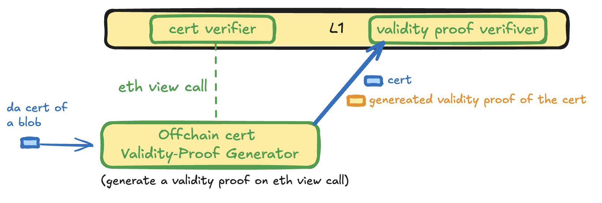
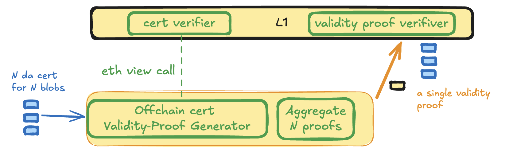
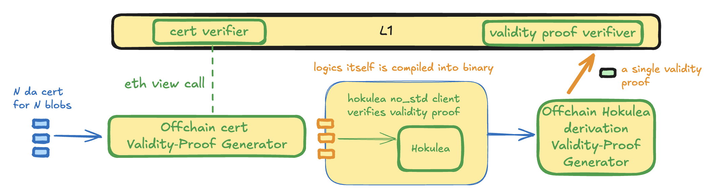

# Canoe

*Securing the EigenDA → Ethereum (L1)*

## 1 · Protocol Overview  

**Canoe** is a framework that proves—on Ethereum—that a given EigenDA blob has been attested by **sufficient stake across every quorum** of EigenDA operators.

| Part | Role |
|-------|------|
| **Smart Contract CertVerifier** | Confirms that the total attested stake for *each* quorum meets or exceeds the required threshold. |
| **Off‑chain Validity‑Proof Generator** | Invokes the Solidity verifier off‑chain and produces a validity‑proof attesting to its output. |
| **On‑chain Validity‑Proof Verifier** | Checks the validity‑proof and the metadata contained in the EigenDA certificate. |

Canoe is under active development and currently supports two zkVM back‑ends: [RISC Zero Steel](https://risczero.com/steel) and [Succinct SP1 Contract Call](https://github.com/succinctlabs/sp1-contract-call).

## 2 · EigenDA V2 (“Blazar”) Upgrade  

In EigenDA V2 the certificate (DA cert) is returned to the requester immediately after quorum attestation; the disperser no longer pessimistically bridges the certs to the L1. Rollup wants to let Ethereum aware cert blob is available can use Canoe or directly verify the DA cert on Etheurem.

## 3 · Canoe security

### 3.Smart contract Verifier
Building on the V1 contract, the new [certificate verifier](https://github.com/Layr-Labs/eigenda/blob/ee092f345dfbc37fce3c02f99a756ff446c5864a/contracts/src/periphery/cert/v2/EigenDACertVerifierV2.sol#L120) can be modeled as

$$ f(S, C; I) -> O $$

| Symbol | Meaning |
|--------|---------|
| `f` | Contract logic |
| `S` | Ethereum state at a specific block (hash & number) |
| `C` | Call data (= EigenDA certificate) |
| `O` | Boolean validity result |
| `I` | L1 Chain ID |

### 3.2 Validity‑Proof Generation (Off‑chain)  

1. An off‑chain prover reconstructs Ethereum state `S` at some block height `h`.  
2. It invokes `f` with certificate `C` with chain ID `I` and records output `O`.  
3. A zkVM produces proof `P` attesting that the tuple `(f,S,C,O,I)` is correct.

The proof `P` is verified by a **Validity‑Proof Verifier** already deployed on L1 (Risc0 or SP1).

## 4 · Use Cases

Canoe is versatile. We list three use cases below, starting with the simplest solution with tradeoff, then slowly working toward the use case which hokulea is integrating.

### 4.1 Direct L1 Certificate Verification  

Protocols verifies `P` **directly on Ethereum**:

* `f`: the on‑chain verifier contract.  
* `C`: the EigenDA certificate to enqueue.  
* `O = true`.  
* `S`: the state of a block *after* the stake snapshot referenced in `C` (enforced by checking the certificate’s reference block number).
* `I`: ethereum chain ID.  

This allows L1 contracts to trust EigenDA blobs without verifying the BLS aggregated signature onchain. The gas cost of verifying a snark proof onchain is 270K gas with  [Sp1](https://docs.succinct.xyz/docs/sp1/generating-proofs/proof-types#groth16-recommended)  and likewise for Risc0.

### 4.2 Aggregate the validity proofs into one proof

For `N` DA certs, protocols can aggregate them together into a single aggregated validity proof such the single proof can be verified on Ethereum

### 4.3 Blob Validity Inside a zkVM (verified by Hokulea)

In rollups that rely on EigenDA, Hokulea is embedded in the derivation pipeline to enable secure OP integration. The Hokulea client itself is compiled into a ELF binary that runs inside the zkVM. After this ELF binary executes, the zkVM outputs a validity proof attesting to the Hokulea client’s run.
While executing, the client validates each canoe certificate by:

Expecting a proof P for every EigenDA certificate encountered.

Verifying and aborting if P fails; otherwise, continuing the derivation process.

Re‑creating (f, s, C, O, I) locally, where s commits to state S. And Check whether it is the same journal commited by the zkVM.

These steps ensure that any invalid certificates are discarded, and a malicious host cannot fool client to accept invalid cert.

## 5 · Securely Verify Canoe Proof

Canoe defines a standard output interface called `Journal` that encapsulates the five parameters for the model above. See solidity type under [binding](../canoe/bindings/src/lib.rs). 
The guest implementation within a zkVM must commit those five variable as the public output. 
This creates a mapping from (f, S, C, I) to O, and the value of the zkVM proof is to attest that such mapping is indeed correct.
It is crucial that given (f, S, C, I), there is only one answer. This is achieved by having a determinstic relation from (f, S, C, I) to O.  
To prevent a host from fabicating a proof attesting some random logic, 
the verifiation logic must independently construct the (f, S, C, I) part of the journal using the trusted data source and compare it against the journal committed by the zkVM, on top of verifying the validity proof produced by Canoe provider. certVerifierAddress is either built into binary or committed onchain L1,
input is the DA certificate, l1ChainId can be found from the bootInfo, the state is anchored by the l1_head used during the challenge process
In Hokulea, such verification takes place in [canoe_verifier](../crates/proof/src/canoe_verifier/).

## 6 · Remark

The Chain Specification defines the rules of the EVM, which underpin the execution semantics of smart contracts. As such, any Ethereum hardfork that introduces changes to EVM behavior necessitates corresponding updates across the proof stack. Specifically, both RISC Zero Steel and SP1 Contract Call backends must be upgraded to align with the new EVM logic. To remain compatible, Hokulea must also integrate an updated version of the zkVM backend that reflects these changes.

Before an Ethereum hardfork is activated, the zkVM backend must audit, prepare, and release an upgraded version to ensure compatibility. Importantly, the universal zkVM verifier deployed on L1 does not require an upgrade with each EVM change, since previously generated contract logic remains valid and backward-compatible across EVM upgrades.

## 7 · Canoe and Hokulea Upgrade

Canoe depends on the zkVM back‑end libraries, so every library upgrade forces a rebuild of its execution artifacts most notably the ELF image of canoe guest(or client in SP1) program. In the Hokulea workflow, the guest program’s fingerprint (an image ID after compilation by Steel, or a verification key by SP1‑Contract‑Call) is hard‑coded into the Hokulea and produces a new ELF. It is used by the zkVM to verify the Canoe proof, meaning any new Hokulea ELF must also be registered on Ethereum L1: deploy the new image ID of Hokulea program that contains the new canoe guest fingerprint.

For rollups built on the OP Stack, an Ethereum hardfork almost always triggers an accompanying OP protocol upgrade; the refreshed Canoe artifacts should be rolled into that same upgrade package.

If any change alters the guest code’s smart‑contract interface, both Canoe and Hokulea need a fresh L1 registration of the new image ID (Risc Zero) or verification key (SP1). To eliminate this extra step, the team is developing a router layer inside the Solidity verifier that will automatically route to the correct image, removing the need for manual updates in the future.
