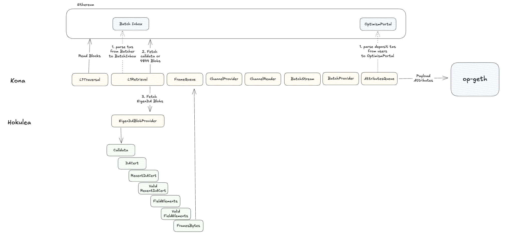
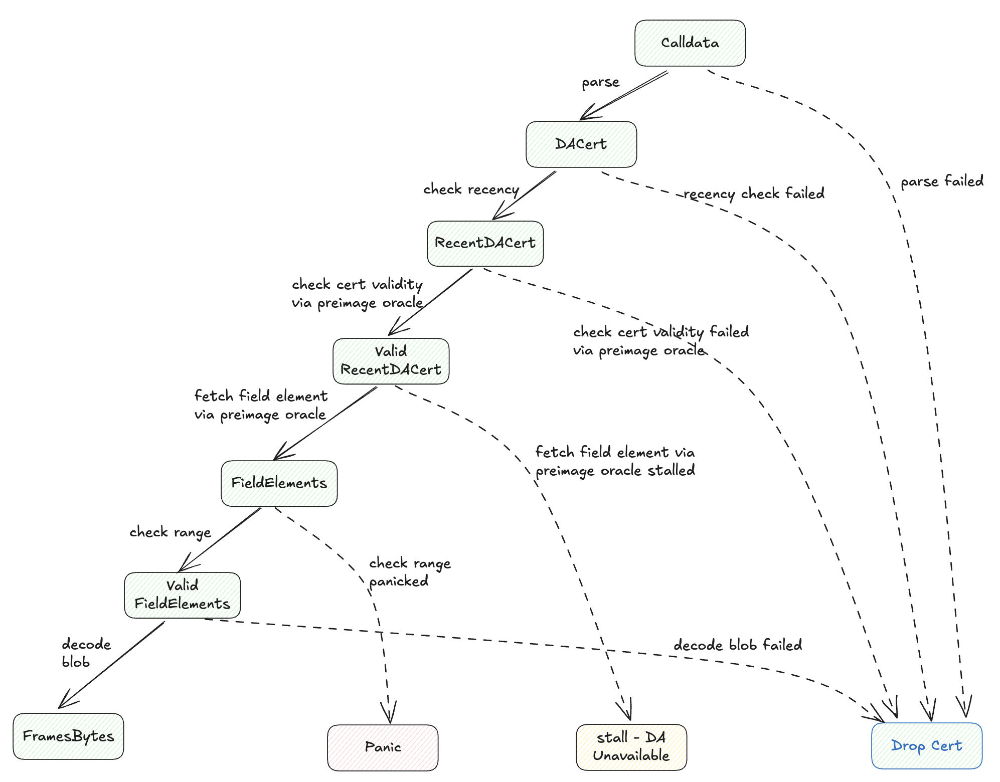

# EigenDA blob derivation for OP stack

The derivation pipeline in OP consists of stages that bring L1 transactions down to Payload Attributes which are L2 blocks 
without output properties like Merkle Patricia Tree Root.

The Kona post-Holocene derivation pipeline contains the following stages
- AttributesQueue
    - BatchProvider
        - BatchStream
            - ChannelReader
                - ChannelProvider
                    - FrameQueue                                                
                        - L1Retrieval (Hokulea enables EigenDABlobProvider to become one of data availability provider)
                            - L1Traversal

The driver of the derivation pipelines calls from the top, and one stage owns the immediate stage below. The L1Traversal stage iterates
over the l1 BlockInfo, then returns it to L1Retieval stage. `BlockInfo` mostly contains metadata like `block_hash`, `block_number`, 
`parent_block_hash` and `timestamp` with respect to the L1 information.
With `BlockInfo`, L1Retrieval can either retrieve data from eth calldata or Ethereum blob.

The Hokulea repo defines traits, implementation and supporting crates to provide secure EigenDA integration in the kona framework.

At the high level, EigenDABlobProvider implements [DataAvailabilityProvider](https://docs.rs/kona-derive/latest/kona_derive/traits/trait.DataAvailabilityProvider.html), that takes `BlockInfo` and `batcher_address` and returns opaque
bytes that are passed into the FrameQueue to derive channel frames.

Under the hood, Hokulea implements the `DataAvailabilityProvider` by composing `EthereumDataSource` from kona and a new Hokulea type `EigenDABlobSource`. The two sources
are glued together in a pipeline fashion, where `EthereumDataSource` passes down L1 calldata retrieved from batcher inbox to `EigenDABlobSource`, which process the calldata to retrieve blobs from EigenDA.

- L1Retrieval
    - EthereumDataSource
        - EigenDABlobProvider

On the batcher side, channel frames are converted into EigenDA blob, whose DA certificate is sent over to L1.
On the op-node side where the hokulea derivation pipeline is ran, the `block_info` is first passed to `EthereumDataSource` to retrieve the
DA certificate.
Then DA certificate is passed to `EigenDABlobProvider` into bytes representing `channel frames`.

Here is a high level diagram that illustrates what hokulea looks like from inside, and where hokulea derivation pipeline lives inside the kona-deriviation.

Begin with `Calldata` passed down from `EthereumDataSource`, there are multiple stages inside hokulea each representing a result of a valid transformation.

- `DA cert` is a parsed data structure from the callldata
- `Recent DA cert` is a DA cert that passes the recency checks defined in the protocol [spec](https://github.com/Layr-Labs/eigenda/blob/master/docs/spec/src/integration/spec/6-secure-integration.md#1-rbn-recency-validation)
- `Valid Recent DA cert` is `Recent DA cert` that is also valid with respect to the quorum attestation constraint more in [spec](https://github.com/Layr-Labs/eigenda/blob/master/docs/spec/src/integration/spec/6-secure-integration.md#2-cert-validation)
- `Field Elements` are part of an EigenDA blob consisted of 32 bytes data unit
- `Valid Field Elements` are `Field Elements` whose every 32 bytes is also a valid number within the bn254 field modulo
- `FramesBytes` are the decoding result based on all `Valid Field Elements`

## Deriving OP channel frames from DA cert

Here is a closer look at the state transition diagram that illustrates the transformation from calldata downloaded from `Calldata` to `FramesBytes`.

There are four end states for a bytes array corresponding to a DA cert
- dropped
- stalled
- panic
- FramesBytes (desired output bytes)

We will go through the state transition one by one. If a condition (arrow) is marked as `failed`, the source of data failed to hold criteria protected by the hokulea derivation, and therefore the corresponding DA certificate must be discarded. There are two possible actor that leads to `failed DA certificate`: op-batcher and a hosting
process that provides preimage to the hokulea derivation pipeline. Additional check are required to ensure data source are valid. Such as KZG commitment verification
and DA certificate verification like [Canoe](../canoe/). We now go over the failure case one by one

- `parse failed` : op-batcher failed to submit a valid DA certificate to rollup inbox
- `recency check failed` : op-batcher failed to submit a DA certificate to rollup inbox **on time**
- `check cert valiidty failed` : op-batcher failed to submit a valid DA certificate that satisfies the [quorum attestaion constraint](https://github.com/Layr-Labs/eigenda/blob/master/docs/spec/src/integration/spec/6-secure-integration.md#2-cert-validation) **OR** the host is misbehaving if the DA certifiate is indeed valid
- `decode blob failed` : it means the host (the eigenda blob preimage provider) has failed to provide an eigenda blob (made of field elements) that satisfies the decoding algorithm see [spec](https://github.com/Layr-Labs/eigenda/blob/master/docs/spec/src/integration/spec/3-datastructs.md#data-structs), it can happen for two possible reasons.
  - the sender (op-batcher) intentionally constructed a malformed eigenda blob by corrupting the encoding algorithm
  - the hosting part that provides the preimage (eigenda blob) transmitted incorrect data

If a condition is marked with stall, it means the data is unavailable in the hosting process that retrieve data on behalf of derivation pipeline.

If a condition is marked as panic, it means the host that supplies the field element violates the clear EigenDA protocol property, i.e. every 32 bytes is a proper
bn254 field element, and by cryptographic property, there isn't a valid kzg commitment.

Finally, if nothing went wrong, the hokulea derivation pipeline returns the desired output.

# Preimage Oracle Address Space

Preimage oracle is the interface which kona (or more generally OP FPVM) uses to retrieve data for progressing the derivation pipeline. At the high level,
a preimage oracle is a key-value store whose key is made of [32Bytes](https://specs.optimism.io/fault-proof/index.html#pre-image-oracle) address. 
The OP spec categorizes the address space, and reserves 0x03 as the generic type which can be used for usage like AltDA.

## Address space for a EigenDA blob
EigenDA blob preimage requests share a great similarity with a 4844 blobs, so we follow the same general scheme as used for 4844 blobs, albeit with a few difference

- We uses generic key 0x03, and the key is constructed as 0x03 ++ keccak256(...)[:31].
- The content of the keccak hash is made of 80 bytes
  - [0:32] is a keccak digest of entire altda commitment (header bytes + DA certificate)
  - [32:72] are zero bytes
  - [72:80] represents an index of the field element in a blob

For every field element in an eigenda blob represented by a DA cert, there is unique address in the preimage oracle.
Furthermore, every DA cert has its own address space for field elements capable of representing 2**64 field elements.

The client communicates with a host to fetch field elements one at a time, and each field element consists of 32 bytes.

Note we deviate from OP spec, which requires sender address to be included in the hash preimage, which we think is unnecessary. See [OP generic key type](https://specs.optimism.io/fault-proof/index.html#type-3-global-generic-key).

## Reserved Addresses for DA certificates

Eigenda secure integration requires additional primitives exposed by the preimage oracle, including
- `certificate validity` that accepts an AltDACommitment and return a boolean indicating if the certificate is valid subject to onchain smart contract [logic](https://github.com/Layr-Labs/eigenda/blob/master/docs/spec/src/integration/spec/6-secure-integration.md#2-cert-validation)
- `recency window request` that takes an AltDACommitment and returns an u64 integer for recency window, more see [spec](https://github.com/Layr-Labs/eigenda/blob/master/docs/spec/src/integration/spec/6-secure-integration.md#1-rbn-recency-validation)

To avoid collision with field element mentioned above, we use the immediate byte following 32 Bytes hash digest for interfaces. See table below
| 32 bytes AltCommitment Digest  | 1 EigenDA Interface Byte | 39 Reserved Bytes |  8 bytes Field Element space | Notes | 
| ------------------------------ | ------------------------ | ----------------- | ---------------------------- | ------------------------- | 
|       ..                       | 0x00                     |       0x0..0      |       ..                     |  Field element addresses | 
|       ..                       | 0x01                     |       0x0..0      |       0x0000000000000000     | certificate validity interface address |
|       ..                       | 0x02                     |       0x0..0      |       0x0000000000000000     | recency window request interface address |

Every AltCommitment (which corresponds to a DA cert) has its unique interface to call certificate validity and to request recency window.

### Hint system with respect to Preimage communication

Before querying about some preimage about an AltDACommitment, the client sends to host a hint which is a serialized AltDACommitment. The host prepares
all the necessary information including recency, validity and eigenda blob, then populate them into its local cache. Next time when the client
actually query about the preimage, the host can directly respond from its local map. Hokulea takes existing hint implementation from Kona, and
include its own hint type called EigenDACert. The sending part of the hint deviates from OP Spec, that it does not include length, and the
receiving side follows the OP spec. Hint system does not affect the secure integration, since all hints are [noop](https://specs.optimism.io/fault-proof/index.html#hinting) on L1 VM.

## Adaptable to both zkVM and interactive fault proof VM

While it is possible for a host to return a data struct that deserialize bytes into (blob, validity, recency window) in one communication round, 
but using the address scheme above, Hokulea keeps the possibility to support the original OP interactive Fault proof. For an interactive game,
players interactively narrow down to a challenge which can be an eigenda field element.
EigenDA currently supports 16MiB blob, and potentially higher in the future. For future compatibility, it is more feasible to challenge one
point as opposed to the entire blob.
Because the above scheme retrieve field element one by one, the player can open a kzg proof onchain to populate the onchain preimage oracle
when it happens to be the last decision point, and therefore resolves the game.
Similarly onchain preimage can be populated to support `certificate validity` and `recency window request`.