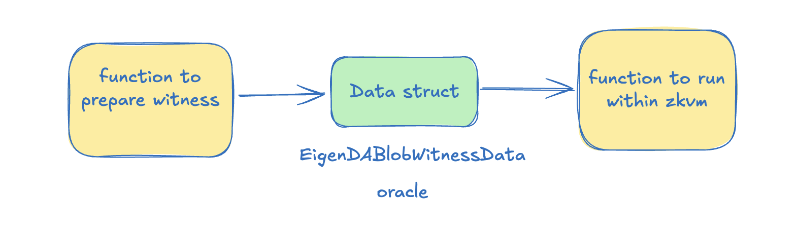
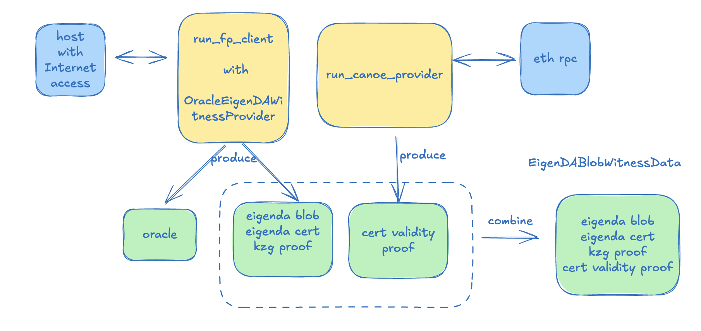
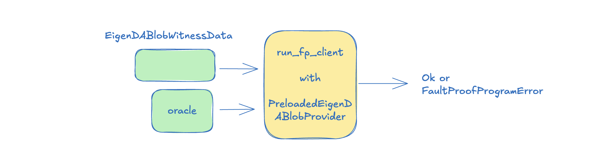

# Preloader

The preloader serves as an example to integrate EigenDA and OP security integration via zkVM. To try it yourself

## Run preloader

User must specify the name where to store the temporary .env file, which is always stored at the directory root
```bash
cd example/preloader
```

NoOp Preloader, that does not generate zk proof for eigenda certificate, used for fast testing. 
```bash
just run-preloader .devnet.env
```

### Run preloader with smart contract and Canoe

Steel Preloader, generate zk proof with steel backend against a smart contract call. More see [Canoe](../../canoe) By default, a mock steel proof (which is cheap to generate) is created and verified by the guest. First we need deploy the contract

```bash
just deploy-mock-contract
```

Then copy the deployed contract address <MOCK_ADDRESS> to a rust constant called <VERIFIER_ADDRESS> under the filepath `canoe/verifier-address-fetcher/lib.rs` and update the value of mapping from chain id `3151908`. Then let' run against steel. Note houklea and kona uses a lagged `l1_head` to trigger the derivation. It is possible that immediately after deploying the mock contract, the
`l1_head` still hasn't reached to the block when the mock contract is deployed. When it happens, wait a few minutes for `l1_head` to catch up, or 
manuall changed the justfile to use the latest L1 block head as l1_head, see [justfile](../../justfile).

```bash
just run-preloader .devnet.env steel
```
Compiling rust code to zkVM bytecode requires installing Risc0 toolchain, see [rzup](https://dev.risczero.com/api/zkvm/install).

Sp1 contract call Preloader, generate zk proof with sp1-cc backend, but in mock mode, no actual proof generated
```bash
just run-preloader .devnet.env sp1-cc
```
The SP1-CC host reads `SP1_CC_PROOF_STRATEGY` to pick the proof fulfillment mode. The default is `reserved` to prove with reserved capacity, or you can set it to `hosted` to prove with Succinct's on-demand prover.

Compiling rust code to zkVM bytecode requires installing Sp1 toolchain, see [sp1up](https://docs.succinct.xyz/docs/sp1/getting-started/install).


You can turn off the mock mode when creating a Steel proof. Currently local proof generation requries a machine with x86 architecture, see [here](https://dev.risczero.com/api/generating-proofs/local-proving#proving-hardware). 

```bash
# Before running the client, it will download the needed g1.point SRS file
# and the rollup.json config file.
just run-preloader .devnet.env steel false
```

### Integrating hokulea with SP1 zkVM

Note that in order to run hokulea in SP1 zkVM with the sp1-cc proof verified within the zkVM, the program input to zkVM (via SP1Stdin) must manually
contain sp1-cc compressed proof using a method called `write_proof()`. This is needed for SP1 [verify_sp1_proof](https://docs.succinct.xyz/docs/sp1/writing-programs/proof-aggregation)
to pick up the compressed proof when verifying the stark proof. For verification code, see [sp1_cc.rs](../../crates/proof/src/canoe_verifier/sp1_cc.rs).

# Workflow and Data Structures

At the high level, a zkVM secure integration uses hokulea+kona derivation twice. At the first run, it creates a data structure called `EigenDAWitness` and `oracle` for kona. In the second run, it feeds `EigenDAWitness` and `oracle` as a data inputs to the hokulea+kona derivation pipeline; but this time the execution of the derivation on the data is executed in the context of zkVM.

<div align="center">
    
</div>

## Witness Generation

Let's look the first run in detail. We mentioned briefly about hokulea+kona derivation, it converts information from L1 and blob from EigenDA into transactions.
In the diagram below, we represent this logic with the name fp_client (fault proof client). A nice feature about kona framework is that kona accepts all 
types of data source implementations as long as they satisfy the data source trait, in our case, `EigenDAPreimageProvider`. 

Hokulea provides an implementation called `OracleEigenDAWitnessProvider` that is not only used by the fp_client, it can also returns an organized data structure
containing all the necessary information above. Running the run_fp_client produces two data structure: an key-value oracle containing all the preimage required by kona, and `EigenDAWitness` containing most of information required by EigenDA data derivation.

<div align="center">
    
</div>

The next step after the first run is to gather the DA cert validity proof, whose most important member is the canoe proof. See the canoe [crate](../../canoe/) 
for more information about proof generation. As in current implementation, there is one canoe proof for each DA cert. 

In the first pass, the fault proof client is allowed to connect to a host with internet access, capable of fetching necessary data with RPC.

## EigenDAWitness

`EigenDAWitness`
- eigenda cert : derived from the derivation pipeline
- encoded payload : comes from hokulea host which downloads from eigenda-proxy.
- kzg proof : deterministically generated based on the encoded payloads.
- cert validity proof : contains a canoe proof and necessary information to verify the canoe proof. More see [canoe](../../canoe/).

## PreloadedEigenDAPreimageProvider

A PreloadedEigenDAPreimageProvider is a data structure that implements the `EigenDAPreimageProvider` trait. It can be used by kona as the eigenda data source for the derivation. 
The internal of the PreloadedEigenDAPreimageProvider are made of queues of preimages of different types.

<div align="center">
    
</div>

Hokulea defines a transformation function to convert `EigenDAWitness` into `PreloadedEigenDAPreimageProvider`, and the transformation contains all the 
necessary checks. It is crucial that the transformation itself is executed within the zkVM.

## Recency Check

(ToDo)

## Acknowledge

This approach is learned from the Kailua repo.
